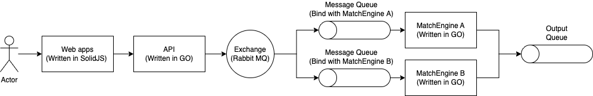

# Q2. Matching Engine

# How to run?

Just simply run ```docker-compose up``` to start all the services.

Noted that port ```3000```,```3001```, ```4001```, ```4002``` ```5672``` and ```15672``` are not being used by other application.

After all the services up and running, visit ```localhost:3000``` to test out the require feature.

- Place a new buy or sell order with a specified instrument and quantity at a given price.
- Retrieve the current order book for a specific instrument.
- Retrieve the executed trades for a specific instrument.
- Cancel an existing order.


----

# Technical details 

## Tech Stack

Frontend web applciation: SolidJS

Order handling API: Golang

Matching Engine: Golang

Message Queue Services: RabbitMQ

## Architecture

